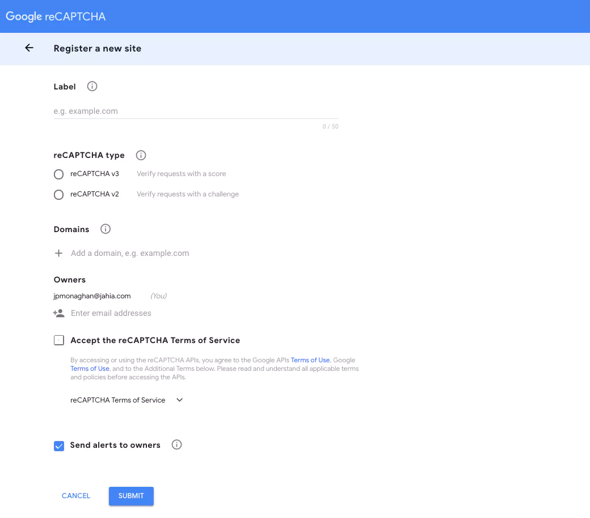
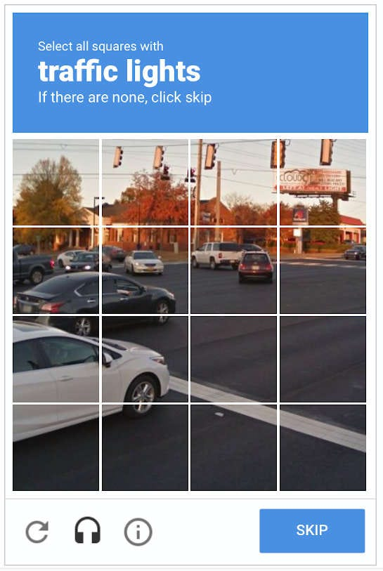

# CAPTCHA Rules and When Users See a Challenge

## Overview
Our service uses CAPTCHA to reduce abuse (bots, automated attacks, scraping, and high-volume spam). Showing a CAPTCHA on every interaction would interrupt the user flow and can reduce retention, so we only show a CAPTCHA **when specific risk rules trigger**.

This page explains:
- What a CAPTCHA trigger means
- Which rules can require CAPTCHA
- What to collect when users report “I keep seeing CAPTCHA”
- When to escalate to Security/Operations

> **Related articles (placeholders)**
> - What is CAPTCHA and why we use it (LINK_PLACEHOLDER)
> - CAPTCHA user flow and UI (LINK_PLACEHOLDER)
> - Admin Panel: Managing CAPTCHA rules (LINK_PLACEHOLDER)
> - IP blacklist management (LINK_PLACEHOLDER)
> - Incident response: traffic spikes (LINK_PLACEHOLDER)
> - Payload comparison rules (LINK_PLACEHOLDER)
> - Support macro: CAPTCHA troubleshooting (LINK_PLACEHOLDER)

---

## Audience
This document is intended for **non-developer tech specialists**, including:
- Support / Customer-facing teams
- Operations and incident responders
- Trust & Safety / anti-abuse analysts

---

## Key terms
- **Request**
  - A single interaction sent to the service (e.g., submit, load, API call).
- **IP address**
  - The network address the request comes from.
  - Note: multiple users can share one IP (corporate networks, schools, VPNs).
- **Payload**
  - The content of the request (the data being sent).
- **Trigger**
  - A rule that causes CAPTCHA to be required for the request.
- **Hour bucket**
  - The current hour’s time window used for volume comparisons.

---

## How CAPTCHA is applied
- CAPTCHA is shown if **at least one** trigger rule matches.
- Multiple rules can trigger at the same time.
- UI wording and user-facing behavior is documented separately:
  - [CAPTCHA user flow and UI](LINK_PLACEHOLDER)

---

## CAPTCHA examples (UI reference)
These images are included as reference examples for non-developers.

**Admin panel example (placeholder screenshot)**  


**User-facing CAPTCHA example (placeholder screenshot)**  


---

## Trigger rules

### Rule 1 — High request volume from a single IP
**Trigger condition**
- More than **500 requests**
- From the **same IP**
- Within **20 minutes**

**Why it exists**
- High request rates from one source are common in automated abuse or misconfigured retry loops.

**Common false positives**
- Many users behind one corporate/school network (shared NAT)
- VPN/proxy providers
- Internal integrations sharing the same outbound IP

**What to collect**
- Is it **one user** or **many users** affected?
- Is the user on a corporate network or VPN?
- Approximate start time and how frequently it happens

---

### Rule 2 — IP address is on the blacklist
**Trigger condition**
- The request comes from an IP present in the **blacklist**

**Why it exists**
- Known abusive sources should be challenged immediately.

**Common false positives**
- Shared IP ranges (VPN providers, cloud providers, corporate NAT)
- Old temporary block that should have expired

**What to do**
- Escalate for blacklist review if legitimate users are impacted.

> See also: [IP blacklist management](LINK_PLACEHOLDER)

---

### Rule 3 — Traffic spike compared to historical baseline
**Trigger condition**
- Current hour bucket request volume is **> 2×**
- The average request volume for the **last 2 weeks**
- For the same hour bucket

**Why it exists**
- Detects unusual spikes that may indicate an attack or sudden automation.

**Common false positives**
- Launches/campaigns/news spikes
- Scheduled batch jobs starting at the top of the hour

**What to collect**
- Time bucket(s) affected
- Any known business events that could explain the spike

> See also: [Incident response: traffic spikes](LINK_PLACEHOLDER)

---

### Rule 4 — Repeated identical payload in a short window
**Trigger condition**
- The **same payload** is sent **more than 5 times**
- Within **30 seconds**

**Why it exists**
- Bots often resend identical data rapidly; also catches tight retry loops.

**Common false positives**
- Double-clicking or repeated refresh
- Client-side bug repeatedly submitting
- Poor connectivity causing fast retries

**Important note (needs definition)**
- Define what “same payload” means (exact match vs normalized match):
  - [Payload comparison rules](LINK_PLACEHOLDER)

---

### Rule 5 — Manually enabled via Admin Panel
**Trigger condition**
- CAPTCHA has been enabled manually via the admin panel for certain requests.

**Why it exists**
- Allows rapid response to emerging threats without code changes.

**When you might see this**
- During incidents
- When a specific endpoint/flow is targeted

> See also: [Admin Panel: Managing CAPTCHA rules](LINK_PLACEHOLDER)

---

## Quick decision flow (high level)

```mermaid
flowchart TD
  A[Incoming request] --> B{Any trigger rule matches?}
  B -- No --> C[Allow request without CAPTCHA]
  B -- Yes --> D[Require CAPTCHA]
  D --> E[User completes CAPTCHA]
  E --> F[Continue request flow]

---

## Troubleshooting guide

### When a user reports: “I keep seeing CAPTCHA”
Collect:
- **When it started**
  - Date/time (approx.)
  - Every attempt or intermittent?
- **Connection context**
  - Home Wi-Fi vs office/corporate network
  - VPN/proxy usage
- **Scope**
  - Only this user, or multiple users on the same network?
- **Action that triggers it**
  - Login, submit, refresh, API call, etc.
- **Technical details**
  - Public IP (if policy allows) or ask Ops to retrieve it
  - Screenshot of the CAPTCHA screen (if possible)

Suggested response macro (placeholder):
- [Support macro: CAPTCHA troubleshooting](LINK_PLACEHOLDER)

---

## FAQ

### Why not show CAPTCHA on every request?
Because it interrupts user flow and can reduce retention. Rule-based CAPTCHA limits friction to suspicious patterns.

### Can more than one rule trigger at the same time?
Yes. Any triggered rule can require CAPTCHA.

### How long does a CAPTCHA trigger last?
Depends on implementation (cooldown/TTL).  
Add confirmed values here once available: **COOLDOWN_TTL_PLACEHOLDER**.

### What if legitimate users are affected due to shared IP (office/VPN)?
Collect scope and connection context, then escalate for review (allowlisting or threshold tuning per policy).

### Can we disable CAPTCHA for a single user?
Usually not recommended. Prefer network-based mitigations (allowlists) and approved rule tuning.

### What information should not be included in tickets?
Do not include passwords, tokens, secrets, or sensitive personal data. Follow internal privacy guidance.

---

## Appendix: Examples (sanitized placeholders)

### Example: CAPTCHA decision event (log)
```json
{
  "timestamp": "2026-03-05T10:23:14Z",
  "request_id": "REQ-123456",
  "ip": "203.0.113.10",
  "captcha_required": true,
  "triggered_rules": ["RULE_1_IP_RATE", "RULE_4_REPEAT_PAYLOAD"],
  "hour_bucket": "2026-03-05T10:00:00Z"
}

### Example: Request payload (sanitized)
```json
{
  "form_id": "feedback_form_v2",
  "fields": {
    "topic": "billing",
    "message": "Example text"
  }
}

### Example: Admin panel configuration (manual enable)
```yaml
captcha:
  manual_enable:
    enabled: true
    scope:
      - endpoint: "/submit"
      - form_id: "feedback_form_v2"
